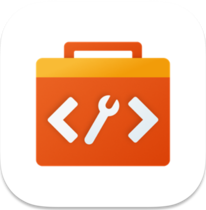
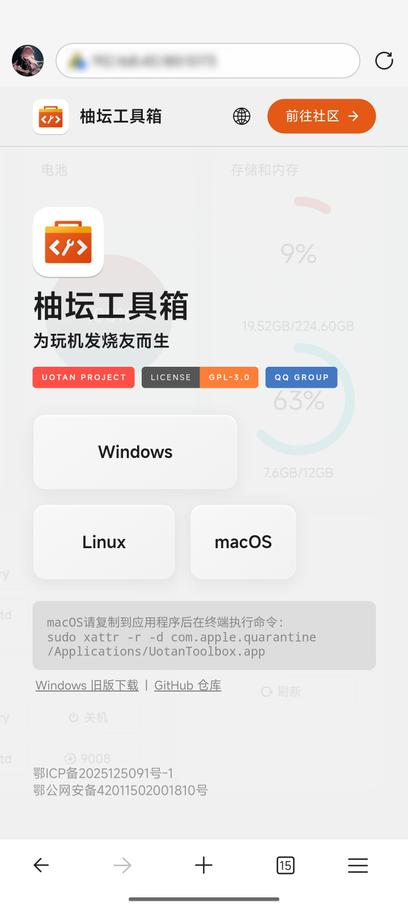
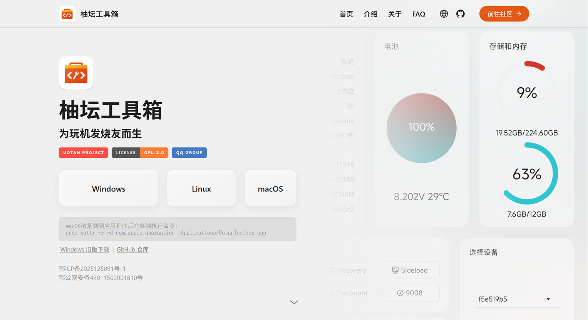
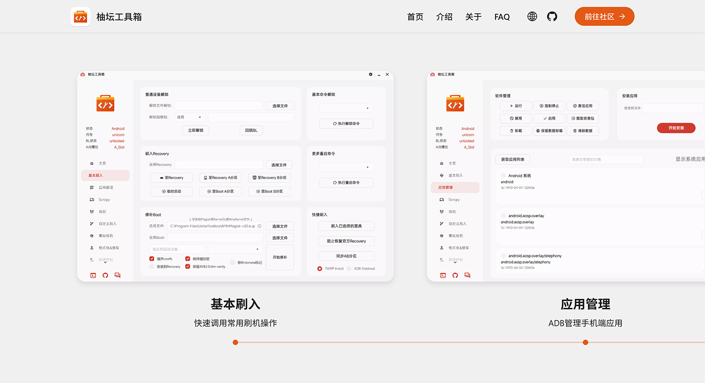
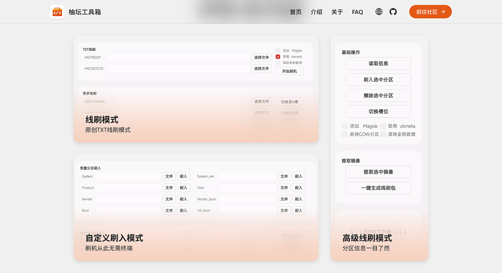
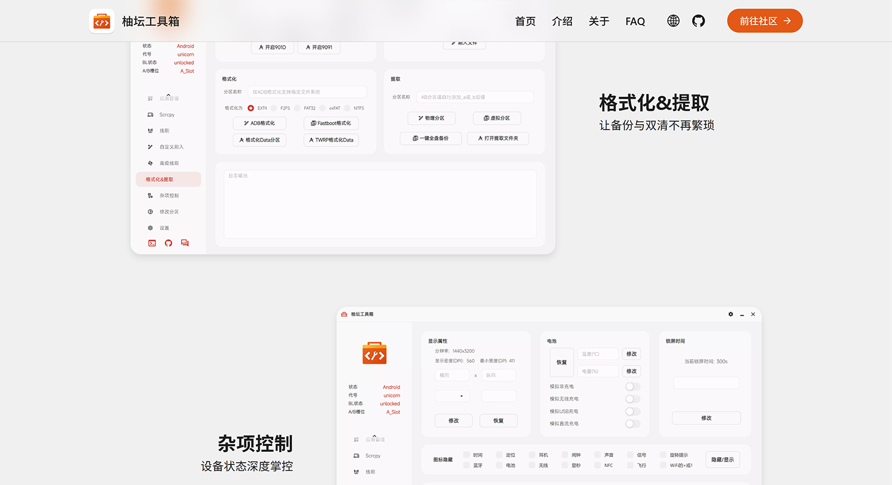
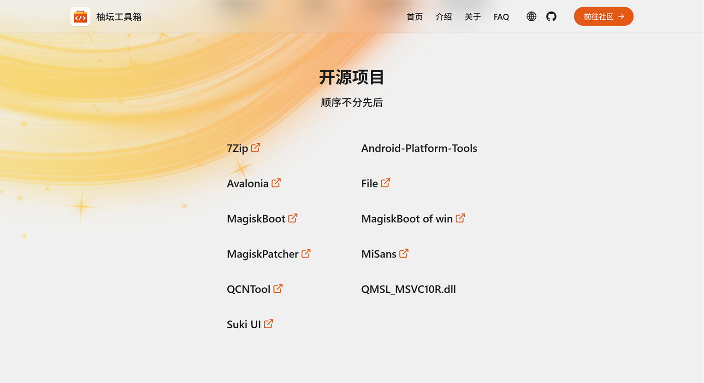
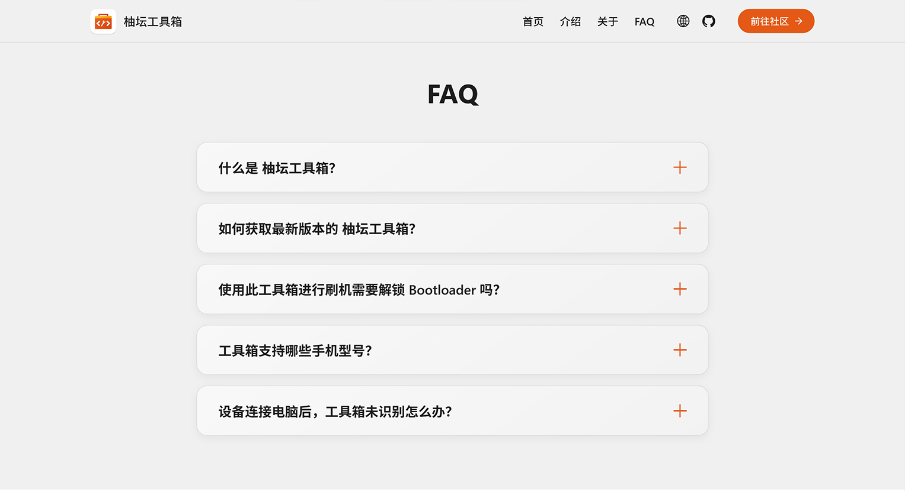

<div id="header" align="center">
	</img>
    <br><br>
	<h1>柚坛工具箱 Website</h1>
	<h3><i>一个为 柚坛工具箱 定制的官网</i></h3>
	<div id="badges" >
		<!-- <a href="https://www.uotan.cn/">
			
		</a>  -->
		<a href="https://github.com/Uotan-Dev/UotanToolboxNT">
			
		</a> 
		<a href="https://github.com/MrBocchi/UotanToolboxWebsite/blob/main/LICENSE">
			
		</a>
		<!-- <a href="https://qm.qq.com/cgi-bin/qm/qr?_wv=1027&k=9IrUA3Rd5Gf6_h9WilwiO8U784SIkXYR&authKey=%2FxSq3qNpRX0i%2BE4lcMijNr3KNFDfdc2sIkcCXxhb4sqsZWHkIcktnkzyQmRNeW8T&noverify=0&group_code=975952599">
			
		</a> -->
		<!-- <a href="https://github.com/Uotan-Dev/UotanToolboxNT/releases">
			
		</a> -->
	</div>
</div>
<br/>

## ✨ 设计风格
- GSAP + ScrollTrigger + 极简现代设计 + 交互设计

## 🌈 功能特色

- [x] 下载链接使用单独的配置文件，配置更方便
- [x] 柚坛工具箱 前端界面预览
- [x] 开发人员列表 & 开源项目列表
- [x] FAQ 及其配置功能
- [x] i18n
- [ ] 手机端仅显示首页（未适配完整功能，但具备下载链接等必要功能）

## 📷 截图

> 静态图片无法呈现完整动效，建议直接预览 [测试网页](https://mrbocchi.github.io/UotanToolboxWebsite)

### 移动端



### 桌面端










## ⚙️ 构建&部署教程

### 1. 安装部署 Node.js 环境；Git 项目至本地

（具体过程略。）

### 2. 修改配置文件

配置文件位于 `config.json` 。

包含：
- 网站 首页 页面中，工具箱不同构建版本的 **下载链接**；
- 网站 FAQ 页面中，**三种语言的问答内容** 配置。

注意事项：

- **下载链接** 严格按照键路径读取。修改时请只修改键值，不要修改任意键名或键路径。若要增加构建版本，请修改 js，以及 css 中三个构建平台的外观宽度。
- **三种语言的FAQ** 也严格依靠语言名称对应地读取。比如，清空或删除 `en` 的内容，不会以 `zh-CN` 的内容填充，而是会显示空白占位字符 `"no_faq": "No common questions yet"`，诸如此类。

### 3. 修改 Vite 配置文件

Vite 配置文件位于 `vite.config.js` 。

主要是配置网站的基础访问路径 `base`：

- 若要发布到 GitHub Page，则去除 3~10 行的注释状态；
- 若要发布到自己的网站，则不作修改，保留其注释状态。

### 4. 安装依赖

```cmd
cd ./UotanToolboxWebsite/

npm i
```

### 5. 构建+发布

```cmd
npm run build
```

复制 `dist` 文件夹内容至对应服务器。